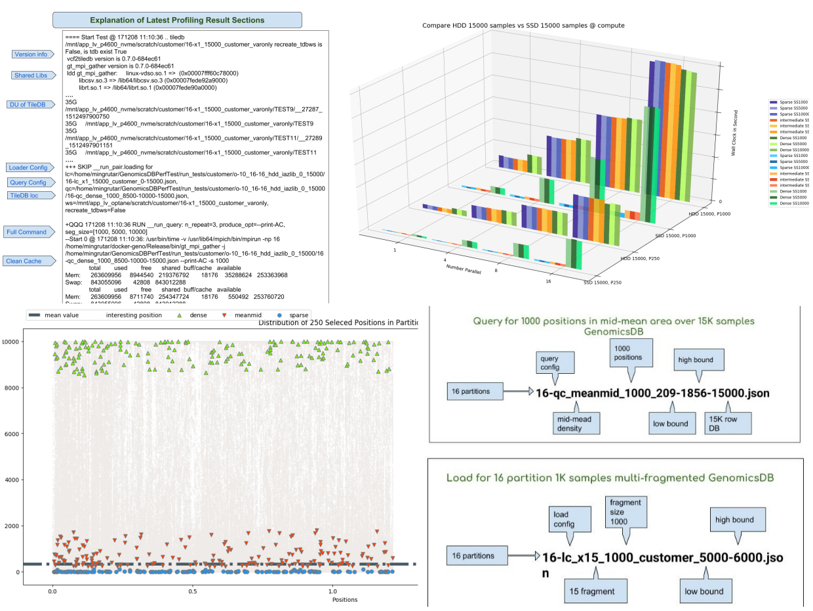

Wrote the following projects:
* [GenomicsDB Performance Profiling](#perf)
* [Docker for Building GenomicsDB utilities](#gdb_builder)
* [GenomicsDB Wrapping Dockers](#util_dockers)

<a id='perf'></a>
### GenomicsDB Performance Profiling

GenomicsDB Profiler is a self-start project for profiling GenomicsDB performance, see GenomicsDB wiki at https://github.com/Intel-HLS/GenomicsDB.



The profiling targets are GenomicsDB utilities <b>‘vcf2tiledb’</b> (data loader) and <b>‘gt_mpi_gather’</b> 
(data retriever). Both utilities require a json config file as input, see detals ay https://github.com/Intel-HLS/GenomicsDB. 
The initial motivation was to automatically generate the labor-intense-to-craft JSON input files that were needed for finding the 
optimal values for loader (vcf2tiledb) input parameters, such as various buffer sizes,  and combination of the parameters. 
Over the time, the profiler has been improved to generate hundreds JSON configure files with various running configurations; launch 
profiling on multiple nodes and visualize profiling results in various ways. 

A single run of vcf2tiledb or gt_mpi_gather is a very simple task. However managing thousands runs with similar configurations on many nodes become very challenging. A single run of vcf2tiledb often take hours. For efficience, the code needs to enable quick test, dry run, reuse existing DB, automatically process results and so on. To address all the issues, GenomicsDB Profiler has a complex name scheme for JSON configuration files and test result files to avoid conflicts and various mechanisn for quick testing. See [GenomicsDB Profiling Document](docs/GenomicsDBProfiling.pdf) for details. 

<a id="gdb_builder"></a>
### Docker for Building GenomicsDB Utilities
This is a self-started project. Building GenomicsDB could be quite time consuming, see GenomicsDB wiki. The project offers scripts for building docker image and run the docker. The created docker image is ready for building GenomicsDB utilities. Running the run script will launch a docker contain that pulls fresh source code from [GenomicsDB github repo](https://github.com/Intel-HLS/GenomicsDB) and builds the GenomicsDB utilities. By default, the container pulls from master branch. However it will pull code from the brach if a branch name is passed in. 

The source code of making the docker could be found at GenomicsDB github branch "[GenomicsDB_dockers](https://github.com/Intel-HLS/GenomicsDB/tree/GenomicsDB_dockers/docker)"

The docker image "genomicsdb_builder" is published at https://hub.docker.com/r/intelhlsgenomicsdb/genomicsdb_builder/.

<a id="util_dockers"></a>
### Docker for Building GenomicsDB utilities and Dockers for GenomicsDB utilities

Two GenomicsDB utility dockers are available: importer and querier, see source code at GenomicsDB github branch "[GenomicsDB_dockers](https://github.com/Intel-HLS/GenomicsDB/tree/GenomicsDB_dockers/docker)"

##### How to build dockers
To build importer docker, run:
<code>$ bash docker_src/VCFImporter_builder/build_docker.bash </code>

To build querier docker, run:
<code>$ bash docker_src/GDBQuerier_builder/build_docker.bash </code>

##### How to use the dockers

Assum we have the following directory and files layout:
```
ROOT
  |_ mapping_data
        |_ customer_vid.json            # vid mapper file
      [ |_ callsets.json  ]             # callsets file. if not preset, code will generates one
  |_ Homo_sapiens_assembly19.fasta      # reference file
  |_ vcfs
        |_ xxx.gz                       # block compressed VCF file
        |_ xxx.gz.tbi                   # index file
        |_ ....
  |_ genomicsdb_ws                      # where genomicsDB will be
```

See https://github.com/Intel-HLS/GenomicsDB/wiki/Importing-VCF-data-into-GenomicsDB for more details on how to make xxx.gz and xxx.gz.tbi from xxx.vcf file.

For syntax,
```
$ docker run vcf_importer:0.6
or
$ docker run genomicsdb_querier:0.9.2-93da4b0-0.5
```
##### example of importing VCF files into GenomicsDB
```
$ docker run -v $ROOT:/myenv vcf_importer:0.6 vcf_importer.py -R /myenv/Homo_sapiens_assembly19.fasta -V /myenv/mapping_data/customer_vid.json  -C /myenv/mapping_data/ -o /myenv/genomicsdb_ws/ -i /myenv/vcfs --range 1:1-249250621
```

<b> example of querying positions with GenomicsDB</b>
```
$ docker run -v $ROOT:/myenv genomicsdb_querier:0.9.2-93da4b0-0.5 genomicsdb_querier.py -R /myenv/Homo_sapiens_assembly19.fasta -V /myenv/mapping_data/customer_vid.json -C /myenv/mapping_data/callsets.json -o /myenv/genomicsdb_ws/ --print-AC --positions /examples/query_1_10_f1.json
```

/examples/query_1_10_f1.json is an example query position file. You can find more by

```
$ docker run genomicsdb_querier:0.9.2-93da4b0-0.5 ls /examples
```

The docker images, "vcf_importer", "vcf_combiner" and "genomicsdb_querier" are published at https://hub.docker.com/u/intelhlsgenomicsdb/
